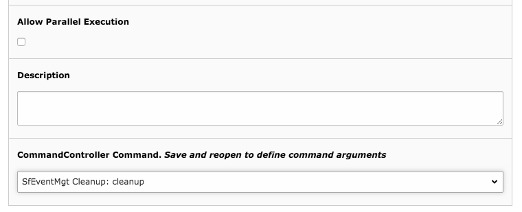

.. ==================================================
.. FOR YOUR INFORMATION
.. --------------------------------------------------
.. -*- coding: utf-8 -*- with BOM.

.. include:: ../../Includes.txt

.. _cronjob:

Cronjob setup
=============

**Only needed if you use registrations for events**

If a new participant registers to an event, she/he must confirm the registration in a
given timeframe (default 1 hour from registration time). If the participant does not
confirms the registration in the given timeframe, the booked place for the event should
be made available again for other participants. In order to remove/hide expired registrations
a scheduler task must be setup. The scheduler task should be configured as shown in the
screenshot below.

Set the frequency to a value of your choice.

Instead of using the scheduler task, you can also run the task on CLI, since the CleanUp command
is registered as command controller.

