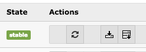

.. ==================================================
.. FOR YOUR INFORMATION
.. --------------------------------------------------
.. -*- coding: utf-8 -*- with BOM.

.. include:: ../Includes.txt

.. _breakingchanges:

Breaking Changes
================

4.0.0
~~~~~

This version contains several braking changes. Make sure, you read the release notes with instructions
at https://github.com/derhansen/sf_event_mgt/releases/tag/4.0.0

3.0.0
~~~~~

Category mode
"""""""""""""

If you have restricted the events in the plugin by category, you need to define the "category mode" by opening the
plugin settings and configuring the category mode. The default value of the "category mode" is to ignore the
category selection, so a category selection from a previous version of the extension would be ignored now!

Youtube embed field
"""""""""""""""""""

The Youtube embed field has been removed. If you want to add a Youtube video to an event, use the TYPO3 core
functionality to add media items to the "files" field of an event.

2.0.0
~~~~~

Flexform restructuring
""""""""""""""""""""""
Due to restructuring of the Flexform settings of the event plugin, it is required to run the update
script of the extension, so existing Flexform settings (e.g. listPid, detailPid, ...) will be migrated
to the new structure. Please use the update script in the extension manager to process the
migration as shown below.

Please click on the update-icon to start the category migration.

Detail-page image-width and height
""""""""""""""""""""""""""""""""""
The following TypoScript needs to be migrated manually.

Old::

 plugin.tx_sfeventmgt.settings {
   eventDetails {
     imageWidth = 200
     imageHeight =
   }
 }

New::

 plugin.tx_sfeventmgt.settings {
   details {
     imageWidth = 200
     imageHeight =
   }
 }

Please also update your Fluid templates, if you use the variables that changed.

1.5.0
~~~~~

The removal of the local category system requires the execution of a migration script, so existing
categories will get migrated to sys_category entries. Please use the update script in the extension
manager to process the migration as shown below.

Please click on the update-icon to start the category migration.

1.2.0
~~~~~

Due to the new cancellation-option for registrations, you need update all plugins, which are
configured to display "Registration" in the "What to display" section. Just open the plugin for edit
and select "Registration" in the "What to display"-selectbox.
