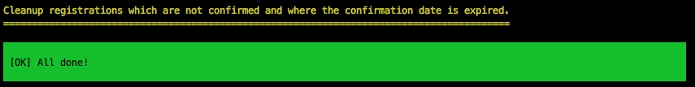

.. ==================================================
.. FOR YOUR INFORMATION
.. --------------------------------------------------
.. -*- coding: utf-8 -*- with BOM.

.. include:: ../../Includes.txt

.. _cronjob:

CLI Commands
============

Cleanup Command
~~~~~~~~~~~~~~~

*Only needed if you use registrations for events*

If a new participant registers to an event, the participant must confirm the registration in a
given timeframe (default 1 hour from registration time). If the participant does not confirms
the registration in the given timeframe, the booked place for the event should be made available
again for other participants.

In order to remove/hide expired registrations, a CLI command is available to remove/hide expired registrations.

Example with :command:`--delete` option::

  ./typo3/sysext/core/bin/typo3 sf_event_mgt:cleanup --delete

Output:

It is recommended to setup a scheduler task to execute the CLI command periodically.
