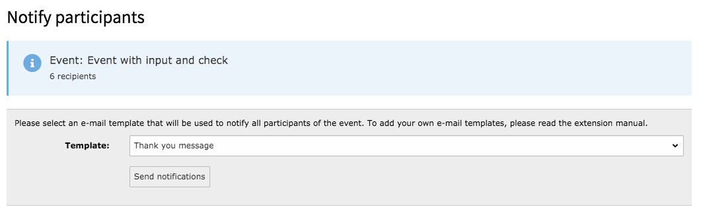

.. ==================================================
.. FOR YOUR INFORMATION
.. --------------------------------------------------
.. -*- coding: utf-8 -*- with BOM.

.. include:: ../../Includes.txt

.. _custom-notifications:

Custom notifications
====================

If you use the registration option for events, you have to possibility to send
custom notifications to all (confirmed) participants of the event. In order to
do so, use the admin module to open the "Notify participants" view.

Create an own notification
~~~~~~~~~~~~~~~~~~~~~~~~~~

To create an own notification, you first need to create a HTML template that will
be used as the notification body. The template must be located in the following
path::

  Templates/Notification/User/Custom/

In this example, I create the file **MyNotification.html**

You can use the following objects in your template:

* {registration}
* {event}
* {settings}
* {hmac}
* {reghmac}

After you created the notification template, you have to configure the new notification
in the TypoScript settings of the **admin module**.::

  module.tx_sfeventmgt {
    settings {
      notification {
        customNotifications {
          myNotification {
            title = A title for the notification
            template = MyNotification.html
            subject = A subject for the e-mail
          }
        }
      }
    }
  }

After configuring the new notification to the TypoScript settings, you can use it to
notifiy participants of the event.

Selecting the recipients of custom notifications
~~~~~~~~~~~~~~~~~~~~~~~~~~~~~~~~~~~~~~~~~~~~~~~~

If you want to send a custom notification only to a selected group of recipients (e.g. those who
actually have paid for the event), you can use the "constraints" setting to limit the recipients.::

  module.tx_sfeventmgt {
    settings {
      notification {
        customNotifications {
          myNotification {
            title = A title for the notification
            template = MyNotification.html
            subject = A subject for the e-mail
            constraints {
              paid.equals = 1
            }
          }
        }
      }
    }
  }

Using the example above, only those participants will receive an email where the field "paid" equals with "1".

You can use the following conditions

* equals
* lessThan
* lessThanOrEqual
* greaterThan
* greaterThanOrEqual

You may also combine the conditions like shown below:::

  module.tx_sfeventmgt {
    settings {
      notification {
        customNotifications {
          myNotification {
            title = A title for the notification
            template = MyNotification.html
            subject = A subject for the e-mail
            constraints {
              paid.equals = 1
              confirmed.equals = 1
            }
          }
        }
      }
    }
  }

Note, that combined conditions are always combined with a **logical AND** statement, so custom
notifications with the example settings from above will be sent to all participants, who have
paid and confirmed to the event.

Also note, that the usage of conditions like shown above are rudimentary and does not cover all
scenarios.