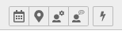

.. ==================================================
.. FOR YOUR INFORMATION
.. --------------------------------------------------
.. -*- coding: utf-8 -*- with BOM.

.. include:: ../../Includes.txt

.. _backend-module:

Backend module
==============

Open the the backend module "Events" from the TYPO3 backend menu and next select
a sysfolder containing your events.

To filter in the list of events, use the 3 search-fields title, startdate and enddate.

Available actions
~~~~~~~~~~~~~~~~~

The backend module contains 2 actions in the upper left.

* The first action creates a new event
* The second action does the same as the cronjob, it hides/removes expired registrations

CSV export
~~~~~~~~~~

With the backend module, you can export a list of participants for events, which are
enabled with the registration option. If the list of fields exported does'nt fit your
needs, you can adjust the fields in the module TypoScript settings as described in the
configuration section of this extension.

Make sure the **user** (or user group) has **read and write access** to the folder ``fileadmin/_temp_/``

Sending custom notification
~~~~~~~~~~~~~~~~~~~~~~~~~~~

For events which are enabled with the registration option, you can also send custom
e-mail notification to the participants of the event. Press the "+" icon to get to
the view, where you can select the custom notification template.

.. figure:: ../../Images/event-custom-notification.png
   :align: left
   :alt: Actions of the backend module

If you want to create a custom notification, you just need to add some TypoScript
and a Fluid template for the new custom notification. Please refer to the manual
in the administration section of this extension.

