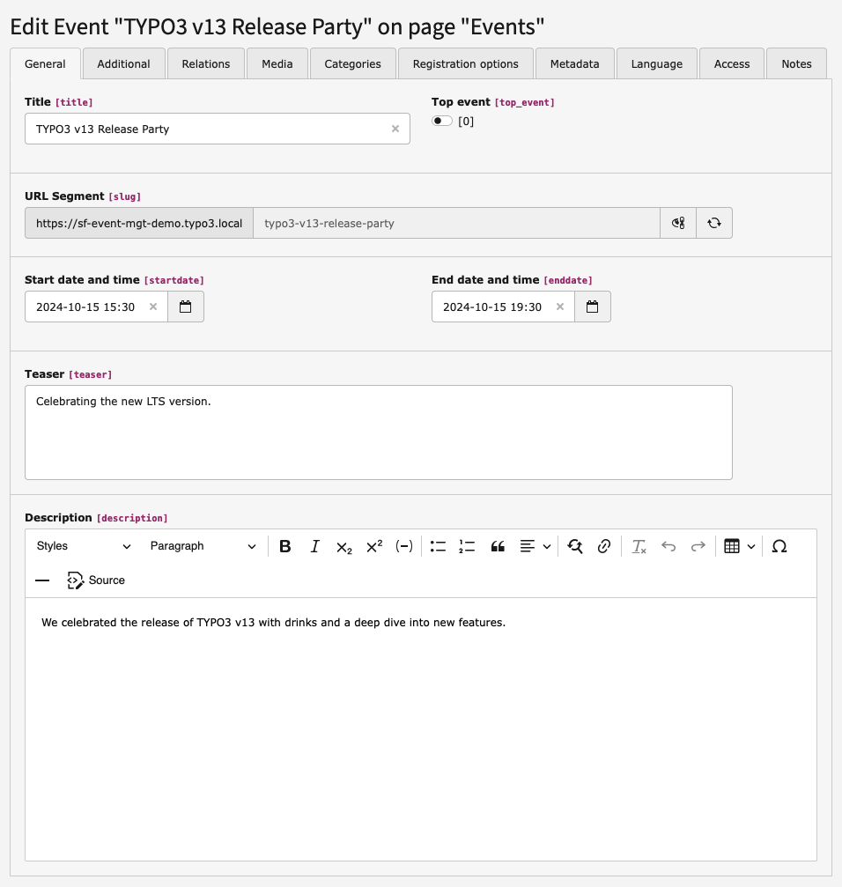
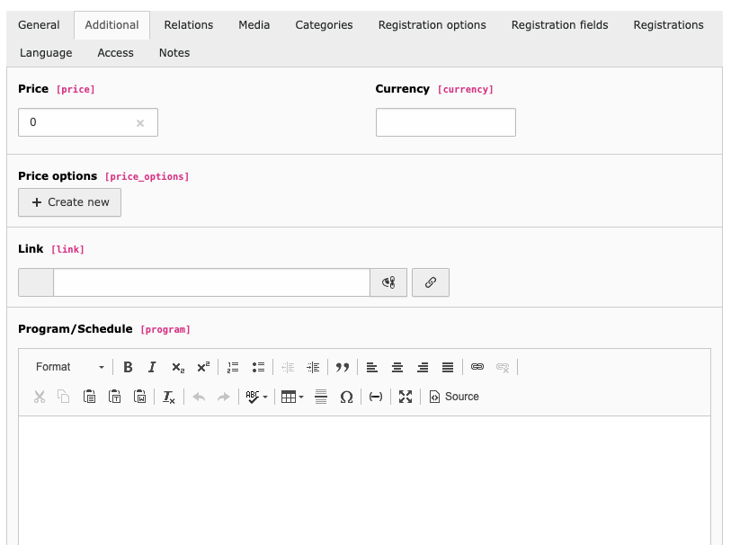
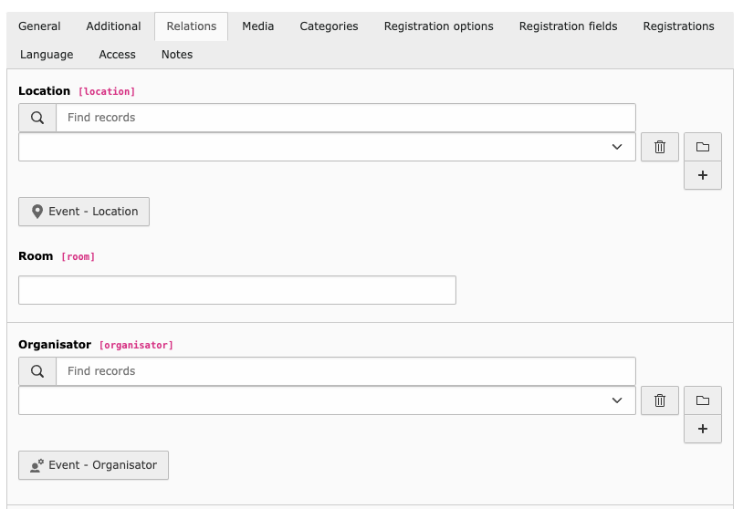
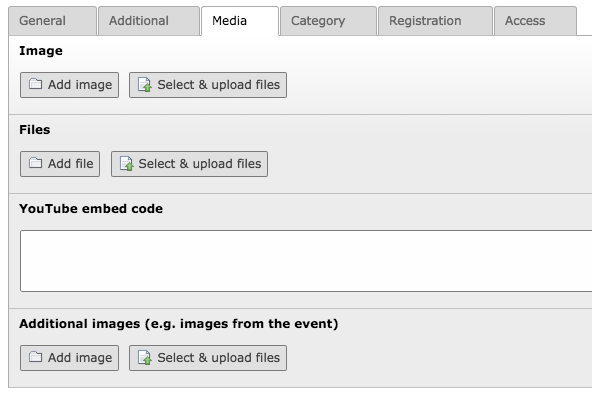
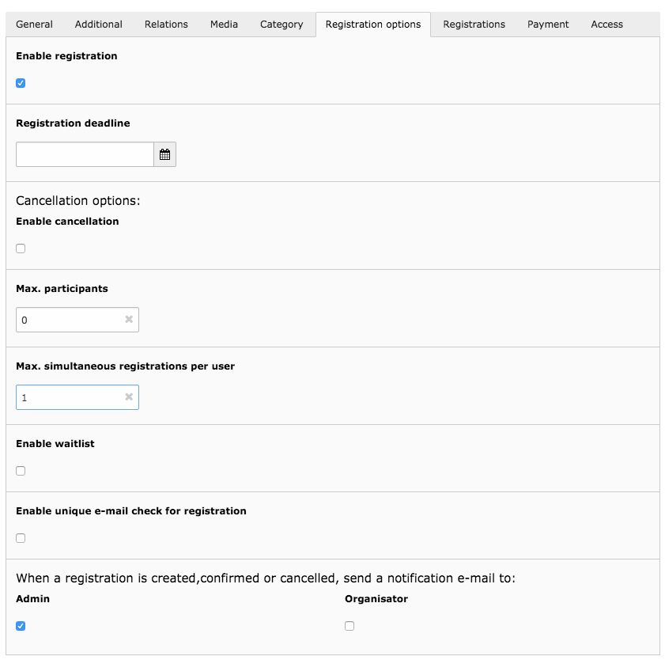
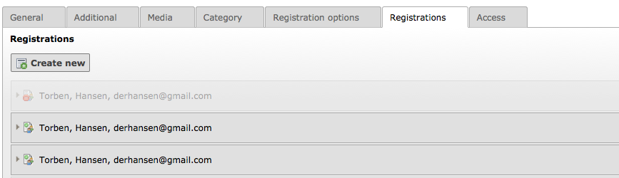
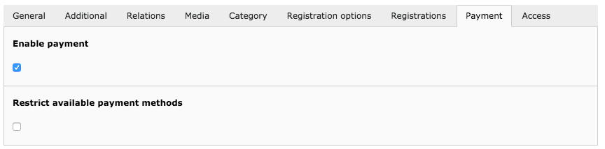

.. ==================================================
.. FOR YOUR INFORMATION
.. --------------------------------------------------
.. -*- coding: utf-8 -*- with BOM.

.. include:: ../../Includes.txt

.. _events:

Events
======

Events are the main record of this extesion. An event contains several fields, which can be used to
describe the event in detail.

General
~~~~~~~

The general tab is used to add general information about the event like a title, start- and enddate
and a description.

.. t3-field-list-table::
 :header-rows: 1

 - :Field:
         Field:

   :Description:
         Description:

 - :Field:
         Hide

   :Description:
         If checked, the event is hidden

 - :Field:
         Top event

   :Description:
         If checked, the event is considered as a top event

 - :Field:
         Title

   :Description:
         Title of the event.

 - :Field:
         Startdate

   :Description:
         Date and time, when the event starts.

 - :Field:
         Enddate

   :Description:
         Date and time, when the event ends.

 - :Field:
         Teaser

   :Description:
         The teaser for the event.

 - :Field:
         Description

   :Description:
         The description for the event.

Additional
~~~~~~~~~~

The additional tab contains additional fields for the event like price, location, organiser, link and
program/schedule.

.. t3-field-list-table::
 :header-rows: 1

 - :Field:
         Field:

   :Description:
         Description:

 - :Field:
         Price

   :Description:
         A price for the event.

 - :Field:
         Currency

   :Description:
         The currency for the price.

 - :Field:
         Price options

   :Description:
         If the event has prices based on a selected date (e.g. early bird price), you can define one or multiple
         price options. The following fields are availabe for price options.

         * Price
         * Date until the price is valid (selected date is included)

         The event management will automatically output the current price if the ``{event.currentPrice}`` getter is used.

 - :Field:
         Link

   :Description:
         A link (e.g. external link) for the event.

 - :Field:
         Program

   :Description:
         The program/schedule for the event.

Relations
~~~~~~~~~

The relations tab contains fields which holds relations locations, organisators and related events.

.. t3-field-list-table::
 :header-rows: 1

 - :Field:
         Field:

   :Description:
         Description:

 - :Field:
         Location

   :Description:
         The location of the event choosen from the location records created.

 - :Field:
         Organisator

   :Description:
         The organisator of the event choosen from the organisator records created.

 - :Field:
         Speaker

   :Description:
         One or multiple speaker of the event.

 - :Field:
         Related events

   :Description:
         One or more related events

Media
~~~~~

The media tab contains fields which holds media-data for the event.

.. t3-field-list-table::
 :header-rows: 1

 - :Field:
         Field:

   :Description:
         Description:

 - :Field:
         Image

   :Description:
         One or more images.

 - :Field:
         Files

   :Description:
         One or more files.

 - :Field:
         YouTube embed code

   :Description:
         A YouTube embed code

 - :Field:
         Additional images

   :Description:
         One or more additional images (e.g. images from the event).

Category
~~~~~~~~

You can assign one or multiple categories to an event.

.. figure:: ../../Images/event-category.png
   :align: left
   :width: 700px
   :alt: Event category tab

.. t3-field-list-table::
 :header-rows: 1

 - :Field:
         Field:

   :Description:
         Description:

 - :Field:
         Category

   :Description:
         One or multiple categories for the event

Registration Options
~~~~~~~~~~~~~~~~~~~~

For each event, it is possible to enable registration and to limit the
amount of free places, so only a limited amount of people can participate to the event. It is also
possible to allow the user to create multiple registrations at once, if the field "Max. simultaneous
registrations per user" is set to a value greater than 1.

.. t3-field-list-table::
 :header-rows: 1

 - :Field:
         Field:

   :Description:
         Description:

 - :Field:
         Enable registration

   :Description:
         Option to enable registration for the event. If enabled, users can register for
         participation to the event.

 - :Field:
         Registration deadline

   :Description:
         If set, registration is only possible until the given date.

 - :Field:
         Enable cancellation

   :Description:
         Option to enable cancellation of registrations for the event. If enabled, users can cancel their
         registration to the event.

 - :Field:
         Cancellation deadline

   :Description:
         If set, cancellation is only possible until the given date.

 - :Field:
         Enable automatic confirmation of event registrations

   :Description:
         If set, new registrations for the event will automatically be confirmed regardless of the global
         setting ``settings.registration.autoConfirmation``

 - :Field:
         Max. participants

   :Description:
         The amount af max. participants. If the value is zero, there is no limitation.

 - :Field:
         Max. simultaneous registrations per user

   :Description:
         The amount of registrations the participant can create with one single registration. If this
         field contains a value greater than 1, a dropdown box can be shown in the registration view
         where the user can select how many registrations should be created.

 - :Field:
         Enable waitlist

   :Description:
         Option to enable a waitlist for the event, if the max. amount of registrations is reached.

 - :Field:
         Enable unique e-mail check for registration

   :Description:
         If set, e-mail adresses of registrations are checked for uniqueness for the event.

 - :Field:
         Notify admin

   :Description:
         When enabled, the administrator will receive an email for new event registrations (create/confirm)

 - :Field:
         Notify organisator

   :Description:
         When enabled, the organisator will receive an email for new event registrations (create/confirm). The e-mail
         sent will use the same template as the admin e-mail.

Registrations
~~~~~~~~~~~~~

Contains all registrations for the event. Only visible, when registration is enabled.

.. t3-field-list-table::
 :header-rows: 1

 - :Field:
         Field:

   :Description:
         Description:

 - :Field:
         Registrations

   :Description:
         A list of participants registered to the event.

 - :Field:
         Registrations on the waitlist

   :Description:
         A list of participants registered to the waitlist of the event. This option is only visible, when the

Payment
~~~~~~~

Contains payment options for the event. Only visible, when registration is enabled.

Custom payment methods can be added. For documentation, please refer to the :ref:`developer_payment` section in the developers manual.

.. t3-field-list-table::
 :header-rows: 1

 - :Field:
         Field:

   :Description:
         Description:

 - :Field:
         Enable Payment

   :Description:
         If checked, a user registering for an event can select available payment options

 - :Field:
            Restrict available payment methods

   :Description:
         If checked, the available payment methods for the event can be restricted

 - :Field:
            Selected payment methods

   :Description:
         Selected payment methods, if "Restrict available payment methods" is checked

Access
~~~~~~

.. t3-field-list-table::
 :header-rows: 1

 - :Field:
         Field:

   :Description:
         Description:

 - :Field:
         Start

   :Description:
         Date/time when event should be shown automatically (by TYPO3)

 - :Field:
         Stop

   :Description:
         Date/time when event should be hidden automatically (by TYPO3)

