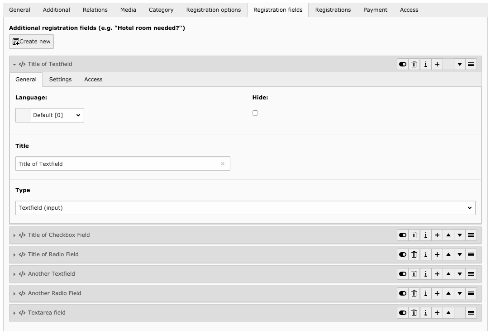

.. ==================================================
.. FOR YOUR INFORMATION
.. --------------------------------------------------
.. -*- coding: utf-8 -*- with BOM.

.. include:: ../../Includes.txt

.. _registrationfield:

Registration field
==================

If the registration option is enabled for an event, you can use registration fields to add additional
fields to the default registration form.

.. t3-field-list-table::
 :header-rows: 1

 - :Field:
         Field:

   :Description:
         Description:

 - :Field:
         Title

   :Description:
         Title of the field. Will be rendered as field label in the frontend

 - :Field:
         Type

   :Description:
         Type of the registration field

         Possible values:

          * Textfield (input)
          * Radiobutton
          * Checkbox
          * Textarea
          * Text
          * Divider
          * Date, Datetime or Time

 - :Field:
         Options

   :Description:
         Options for the type "Radiobutton" and "Checkbox".

         Example:

         Option 1|value1
         Option 2|value2

 - :Field:
         Required

   :Description:
         If checked, field must be filled out in frontend

 - :Field:
         Placeholder

   :Description:
         Placeholder for the field

 - :Field:
         Default value

   :Description:
         The default value of the field

 - :Field:
         Date input mode

   :Description:
         Only visible when the selected field type is "Date/Time".

         Selects the date input mode: either 'date' (default), 'datetime' or 'time'

         **Please note**: The default template just uses HTML5 input types. You might want to extend that to use a
         JavaScript datetimepicker instead.