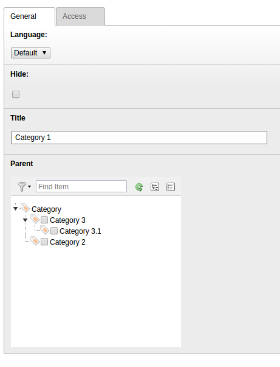

.. ==================================================
.. FOR YOUR INFORMATION
.. --------------------------------------------------
.. -*- coding: utf-8 -*- with BOM.

.. include:: ../Includes.txt

.. _categories:

Categories
==========

You can create categories to structure event records in the frontend (e.g. show events which belong to one
or more categories)

.. t3-field-list-table::
 :header-rows: 1

 - :Field:
         Field:

   :Description:
         Description:

 - :Field:
         Title

   :Description:
         Title of the category.

 - :Field:
         Parent

   :Description:
         Parent category