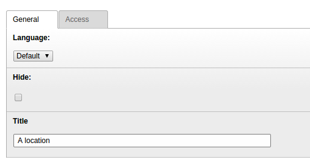

.. ==================================================
.. FOR YOUR INFORMATION
.. --------------------------------------------------
.. -*- coding: utf-8 -*- with BOM.

.. include:: ../Includes.txt

.. _locations:

Locations
=========

Locations can be assigned to an event. In the current version, the location contains only the field
title. Future versions of this extension may contain additional fields like the address or the geographical
data of the location.

.. t3-field-list-table::
 :header-rows: 1

 - :Field:
         Field:

   :Description:
         Description:

 - :Field:
         Title

   :Description:
         Title of the category.
