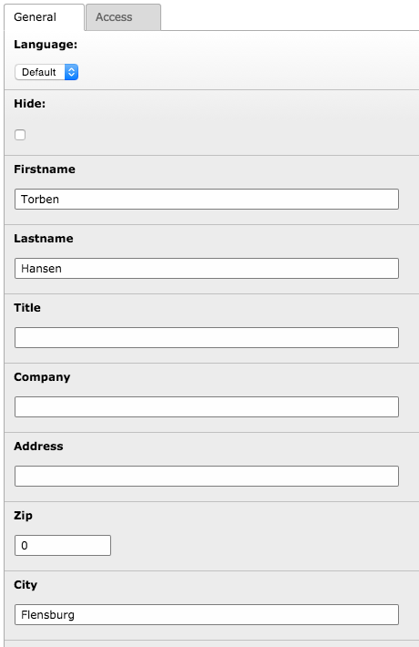

.. ==================================================
.. FOR YOUR INFORMATION
.. --------------------------------------------------
.. -*- coding: utf-8 -*- with BOM.

.. include:: ../Includes.txt

.. _registrations:

Registrations
=============

If the registration option is enabled for an event, participants can register to the
event. A registration contains the data the participant entered during the registration
process and also some administration fields like "confirmed" or "paid"

.. t3-field-list-table::
 :header-rows: 1

 - :Field:
         Field:

   :Description:
         Description:

 - :Field:
         Firstname

   :Description:
         Firstname of participant

 - :Field:
         Lastname

   :Description:
         Lastname of participant

 - :Field:
         Address

   :Description:
         Address of participant

 - :Field:
         Zip

   :Description:
         Zip of the participant

 - :Field:
         City

   :Description:
         City of the participant

 - :Field:
         Country

   :Description:
         Country of the participant

 - :Field:
         Phone

   :Description:
         Phone of the participant

 - :Field:
         E-mail

   :Description:
         E-mail of the participant

 - :Field:
         Gender

   :Description:
         Gender of the participant

 - :Field:
         Date of birth

   :Description:
         Date of birth of the participant

  - :Field:
         Notes

    :Description:
         Notes from the participant

 - :Field:
         Confirmation until

   :Description:
         Administration field. Date/time until the registration must be confirmed. Hides automatically,
         when the registration has been confirmed.

 - :Field:
         Confirmed

   :Description:
         Administration field. Will be set automatically, when the user confirms the registration.

 - :Field:
         Paid

   :Description:
         Administration field used to set if the user has paid for the event

